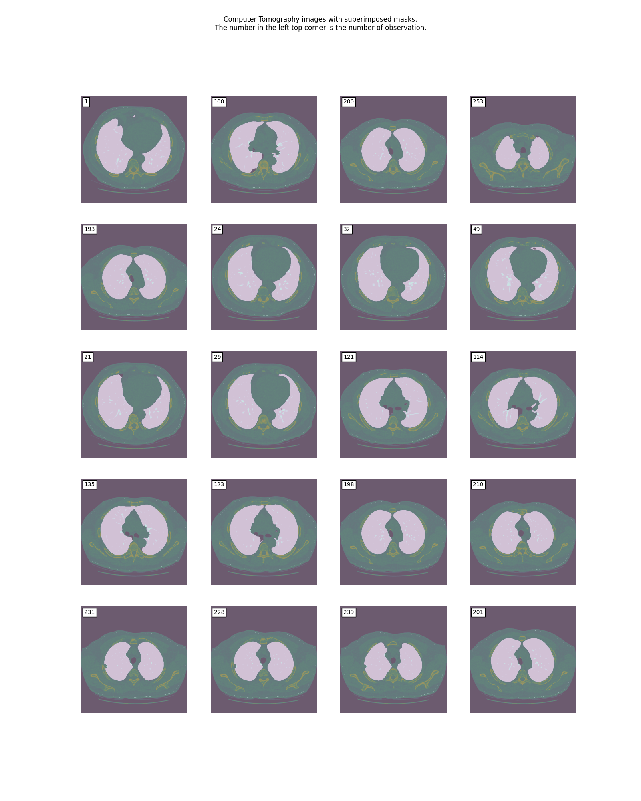

# Praca domowa nr 1 - Zbiory danych
## 1. Opis zbioru danych
Zbiór danych wykorzystywany przez twórców artykułu składa się z czterech plików z rozszerzeniem nii.gz. Jest to format NIfTI (Neuroimaging Informatics Technology Initiative), który jest formatem otwartym używanym do przechowywania zdjęć medycznych. Pliki w tym formacie zawierają nagłówek, z którego można odczytać podstawowe informacje na temat obrazu.

Autorzy artykułu korzystają z czterech zdjęć 3D wykonanych przy pomocy tomografii komputerowej o łącznym rozmiarze 427MB. Na każde zdjęcie składa się od 117 do 470 poziomych przekrojów(widok płuc patrząc z góry) o rozdzielczości 512 x 512. Rozmiar pojedynczego zdjęcia 3D waha się pomiędzy 43MB a 168MB w zależności od liczby przekrojów, z których się składa. Po rozpakowaniu zdjęć oraz wczytaniu ich zawartości, mierzymy rozmiar pojedynczego przekroju i zauważamy, że wynosi on około 2MB.
Podsumowując otrzymujemy około 1200 zdjęć płuc w poziomym przekroju o wymiarach 512 x 512 o rozmiarze 2MB i to one są wykorzystywane do uczenia sieci neuronowej BCDU-Net.

Dodatkowe własności możemy odczytać z nagłówka każdego z wyżej wymienionych plików. Dla wszystkich zdjęć rozmiar voxela wynosi 16 bitów oraz przechowuje on jedną liczbę typu `int`, możemy z tego wywnioskować, że omawiane zdjęcia są skali szarości.

## 2. i 3. Zbadanie właściwości zbioru danych
W treści artykułu (R. Azad, M. Asadi, Mahmood Fathy and Sergio Escalera, "Bi-Directional ConvLSTM U-Net with Densley Connected Convolutions") autorzy wspominają o zbiorze danych następującymi zdaniami:

"A lung segmentation dataset is introduced in the Lung Nodule Analysis (LUNA) competition at the Kaggle Data Science Bowl in 2017. This dataset consists of 2D and 3D CT images with respective label images for lung segmentation [38]. We use 70% of the data as the train set and the remaining 30% as the test set. The size of each image is 512 × 512. For this dataset, the MCGU-Net works better with training from scratch since the input data is entirely different from images in ImageNet dataset. "

Przy czym cytowanie [38] odnosi się do linku do strony [https://www.kaggle.com/kmader/finding-lungs-in-ct-data](https://www.kaggle.com/kmader/finding-lungs-in-ct-data). Z treści nie dowiadujemy się więc nic na temat zbalansowania danych pod względem płci, wieku, czy innych czynników. Autorzy nie opisują również, czy w sami w jakikolwiek sposób badali dane pod takim względem. Z kodu widzimy, że zbiór danych jest podzielony na testowy i walidacyjny po prostu pod względem kolejności występowania w zbiorze. Zatem można sądzić, że nie zostały użyte żadne metody służące do zbalansowania obserwacji.

Mimo, że autorzy artykułu nie próbowali patrzeć na swoje dane pod tym względem, postanowiliśmy sprawdzić, czy strony udostępniające dane posiadają jakieś informacje na temat zróżnicowania danych pod względem różnych czynników. Na stronie, do której link znajdował się w artykule, zbiór danych jest opisany w bardzo lakoniczny sposób, nie znajdują się tam żadne dane na temat osoby, od której konkretne zdjęcie pochodzi.

W opisie zamieszczony jest jednak odnośnik do strony [http://luna16.grand-challenge.org/](http://luna16.grand-challenge.org/), z której oryginalnie pochodził zbiór. W odpowiedniej zakładce można znaleźć już bardziej dokładny datasetu, jednak w opisie nie znajdują się żadne informacje na temat osób, od których zdjęcia pochodzą. Autorzy tego opisu skupiają się głównie na technicznych informacjach dotyczących danych - np. format, warunki robienia badania itd. Ponieważ zbiór ten jest upubliczniony z licencją "Creative Commons Attribution 3.0 Unported License" domyślamy się, że dane zostały zanonimizowane, aby uniknąć udostępniania wrażliwych informacji.  

## 4. Segmentacja: informacje o maskach oraz porównanie ich z oryginalnymi obrazami

Proponowana przez twórców artykułu sieć neuronowa  BCDU-Net, zwracająca maski płuc na podstawie obrazu tomografii komputerowej, składa się z kilku komplementarnych modułów. Budowa całego modelu jest dosć skomplikowana, wobec czego autorzy zdecydowali się na stworzenie diagramu ilustrującego przepływ danych w sieci.  
Istotnym momentem w procesie estymacji maski jest usunięcie z obrazu tkanek otaczających płuca, które w przypadku tych badań nie mają znaczenia (koncentracja na predykcji kształtu samych płuc) - autorzy uczynili to w etapie tzw. "post-processingu". Ostatecznie, wytworzone maski są de facto tablicą z pakietu numpy (`numpy.array`), składującą wartości 0 lub 1 - utworzony obraz jest o jednobitowej głębi kolorów. Taka struktura maski pozwoliła zmierzyć efektywność modelu przy pomocy miar typowych dla problemu klasyfikacji. Rozmiar obrazu zawierającego maskę to 512 x 512. Proponowany przez autorów zbiór testowy składał się z 307 predykcji. Poniższe grafiki prezentują przykładowe oryginalne obrazy tomografii komputerowej płuc oraz wytworzone na ich podstawie maski.

*Obrazy tomografii komputerowej płuc z maskami nałożonymi w półprzezroczystości*

*Porównanie obrazów tomografii komputerowej płuc z wytworzonymi maskami*
