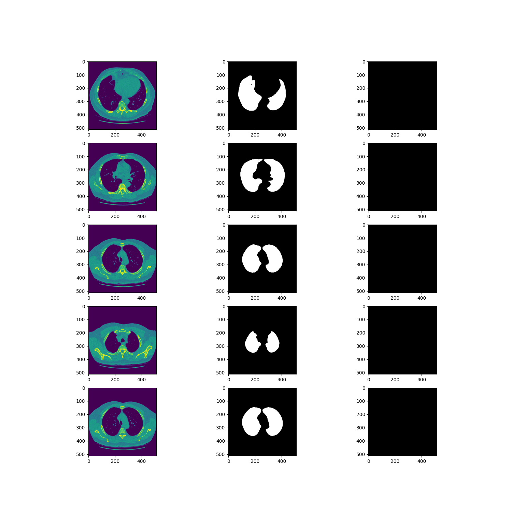
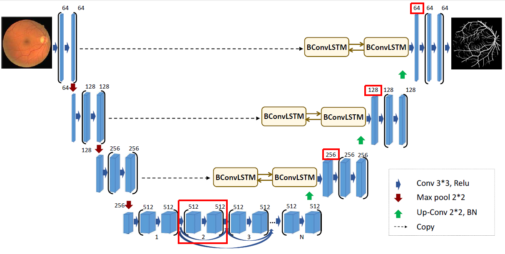
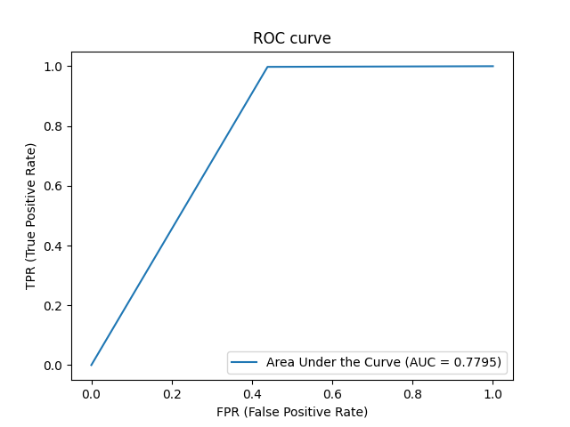

# Praca domowa nr 2 - Architektura sieci neuronowych
Celem pracy domowej nr 2 jest modyfikacja architektury sieci neuronowej `BCDU-Net`, używanej do tworzenia masek na podstawie obrazów tomografii komputerowej. W wyniku zmian powstały trzy nowe architektury, proponowane przez każdego z członków zespołu.

Celem przypomnienia, tak wygląda architektura proponowana przez autorów projektu `BCDU-Net` [(Azad et. all, 2020)](https://github.com/rezazad68/BCDU-Net):

## Marysia

## Mikołaj

## Paweł Koźmiński
### Motywacja pierwszej próby
Podjęta w moim wykonaniu pierwsza próba modyfikacji architektury sieci neuronowej `BCDU-Net` motywowana była własnymi intuicjami na podstawie zaproponowanego rozwiązania przez autorów projektu oraz obserwacji z tytułu uczestnictwa w zajęciach z przedmiotu Metody Inteligencji Obliczeniowej. Wprowadziłem szereg prób, jednak jak się okazało, nie były one skuteczne:
 - po pierwsze, zmiana metody inicjalizacji parametrów z metody `he_normal` na `glorot_uniform` - zwanej również metodą Xavier, która w moim odczuciu pozwala osiągać równie wysokie, o ile nie wyższe, wyniki modeli,
 - dodałem kolejną, czwartą warstwę połączeń gęstych na dole sieci - jest to moim zdaniem newralgiczny moment całej architektury, wyróżniający to rozwiązanie spośród innych, więc rozwinięcie go potencjalnie mogło przynieść jeszcze wyższe rezultaty,
 - zmodyfikowałem funkcję aktywacji warstwy wyjściowej z `sigmoid` na `softmax`, znaną jako skuteczną w zadaniach klasyfikacji,
 - zmieniłem kernel_size sieci `BConvLSTM` z `(3,3)` na `(2,2)` - być może mniejszy rozmiar jądra oznaczałby dokładniejsze wykonywanie operacji.

Główne zmiany zaznaczone na architekturze sieci prezentują się następująco:

### Wynik pierwszej próby
Niestety pierwsza próba modyfikacji architektury przyniosła efekt odwrotny od oczekiwanego. Model zupełnie nie nauczył się tworzenia masek, zwracał obrazy w całości pomalowane na czarno. Przypisanie każdemu pikselowi wartości 0, przyniosło wprawdzie wartość miary accuracy na poziomie 85%, jest to jednak doskonały przykład na wadę tej funkcji - wartość specifity wyniosła 0, a AUC 0.5. 
Czas działania jednej epoki zmodyfikowanej sieci spadł o około 10%.

Przykład zwróconych przez sieć wyników:

### Motywacja drugiej próby
Po porażce poniesionej przez pierwszą wersję zmodyfikowanej architektury, zdecydoawłem się zajrzeć do literatury - badań naukowych zajmujących się podobnym problemem. Autorzy projektu `BCDU-Net` sami wskazują kilka analogicznych projektów - między innymi [(Ronneberger and etc. all, 2015)](https://arxiv.org/abs/1505.04597). Korzystając z proponowanej formy w powyższym artykule zdecydowałem się na:
 - usunięcie jednej z warstw połączeń gęstych na najniższym z poziomów,
 - zmiana rozmiaru niektórych warstw poprzez dwukrotne ich zwiększenie - zgodnie z wersją proponowanym w cytowanym artykule oraz
 - pozostawienie metody inicjalizacji Xaviera - tym razem jednak `glorot_normal`.`
Funkcja aktywacji ostatniej z warstw pozostała niezmieniona - `sigmoid`. 

Miejsca zmian zostały zaznaczone na poniższej ilustracji:

### Wynik drugiej próby

Proponowana druga wersja modyfikacji architektura sieci przyniosła wyższe wyniki od pierwszej. Wartość AUC na poziomie 0.78, czułość bliska 1 oraz swoistość 0.56 również nie są najgorsze. Analizując jednak uzyskane maski, szybko można zauważyć jednak, że sieć nie zwracam poprawnych wyników. Odpowiednio określany jest rozmiar przekroju ciała, którego obraz tomografii został wykonany, jednak z wnętrze płuc pozyskiwane są wyłącznie nieliczne punkty. Czas trenowania nowej sieci wzrósł w porównaniu z pierwotną o około 9%.

Przykłady estymowanych masek oraz wykres ROC proponowanej architektury:

### Wnioski
Uzyskane przez proponowane zmodyfikowane architektury sieci są znacząco niższe od tych prezentowanych przez twórców artykułu. Niestety trudno było rywalizować z rozwiązaniem, które osiągnęło wartość AUC równą 0.9946. Uzyskane estymacje masek są jednak niskiej jakości i raczej nie mogłyby być użyte w praktycznych zastosowaniach.

## Podsumowanie
