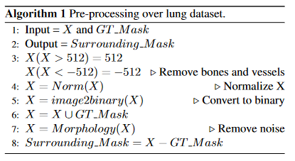
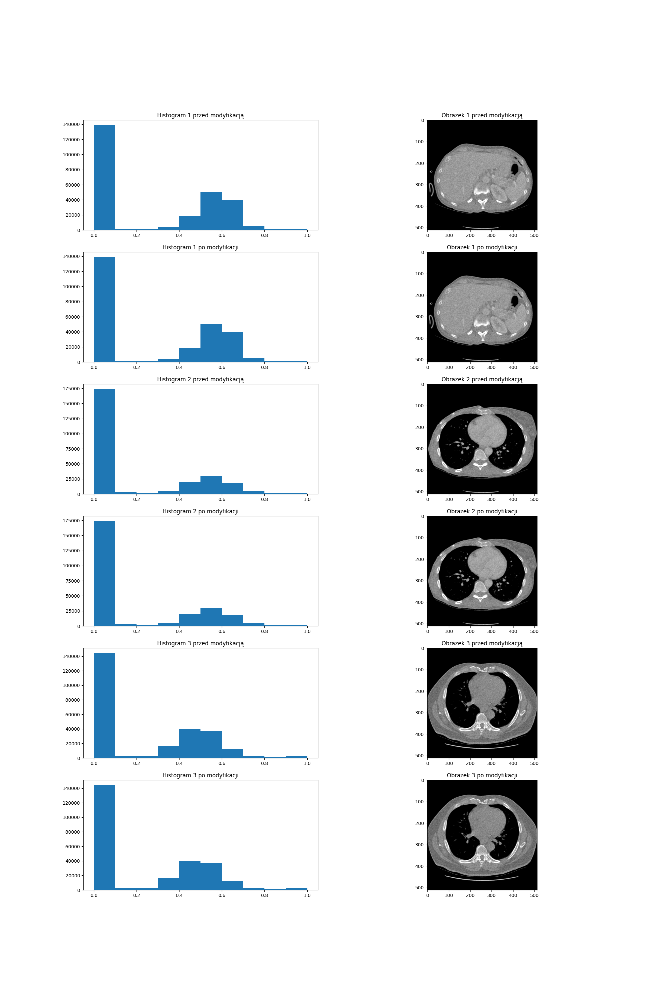

# Praca domowa nr 3 - preprocessing
## Część pierwsza
Fragment opisujący preprocessing zawarty w artykule.
>A lung segmentation dataset is introduced in the Lung Nodule Analysis (LUNA) competition at the Kaggle Data Science Bowl in 2017.  This dataset consists of 2D and 3D CT images with respective label images for lung segmen-tation [1].  We use 70% of the data as the train set and the remaining 30% as the test set.  The size of each image is 512×512. Since the lung region in CT images have almost the same Hausdorff value with non-object of interests such as bone and air, it is worth to learn lung region by learning its surrounding tissues.  To do that first we extract the surrounding region by applying algorithm 1 and then make anew mask for the training sets. We train the model on thesenew masks and on the testing phase,and estimate the lung region as a region inside the estimated surrounding tissues.
>

Dokładna analiza preprocessingu dokonanego przez twórców artykułu, znajduje się Jupyter Notebook'u w folderze code.
## Część druga

Pierwszą wykonaną operacją na histogramie jest 'contrast stretching'. Metoda ta polega na tym, aby 'rozciągnąć' histogram na całą możliwą skalę kolorów. Przykładowo, jeśli na obrazie występowałyby piksele o wartościach z przedziału [100;200], to zostałyby rozciągnięte poprzez odjęcie od każdego piskela minimalnej wartości i podzielenie przez długość oryginalnego przedziału, tak, aby wypełniały cały przedział [0; 255]. Do uczenia naszego modelu podajemy wartości pikseli z zakresu [0;1], więc przeprowadziliśmy ponowne skalowanie.

Niestety większość obrazów w naszych danych od razu wypełniała całą przestrzeń szarości, więc zmiany są bardzo subtelne, nawet niezauważalne.

Wyniki (albo ich brak) prezentuje poniższy wykres:

W drugiej próbie postanowiłem wykorzystać technikę 'histogram equalization'. Polega ona na takiej zmianie wartości na obrazie, aby wszystkie wartości pikseli występowały mniej więcej równomiernie. Zamierzone działanie przedstawia poniższy rysunek

source: [https://staff.fnwi.uva.nl/r.vandenboomgaard/IPCV20162017/_images/histeq.png](https://staff.fnwi.uva.nl/r.vandenboomgaard/IPCV20162017/_images/histeq.png)

Metoda polega na zastosowaniu interpolacji na skumulowanych sumach wartości z histogramu. Ma ona jednak jedną wadę - jeśli interpolujemy zera, to w wyniku również dostaniemy zera. Znaczna część obrazów z naszego zbioru miała dużą ilość czarnych pikseli, więc wygładzenie zadziała tylko na pozostałej części histogramu Na danych z naszego zbioru prezentuje się to tak:

Na trzecią modyfikację wybraliśmy przekształcenie nieliniowe tanh(x + 0.8). Tak zastosowane przekstałcenie rozjaśnia piksele o wartości większej od zera.
Aby wartości przyjmowane przez piksele mieściły się w przedziale [0; 1], zostały one znormalizowane metodą min-max.  Następnie w celu wyświetlenia obrazów przemnożyliśmy wszystkie piksele przez 255, by były z zakresu [0; 255].

## Część trzecia - Preprocessing stosowany do obrazów tomografii komputerowej głowy (z kontrastem i bez)

Dział analizy danych zajmujący się przetwarzaniem obrazów medycznych, między innymi ze względu na wysoką przydatność społeczną, jest jednym z najszybciej rozwijających się gałęzi tej nauki. Jednak każdy badacz statystyczny doskonale jest świadomy, że nim przejdzie się do dziedzinowej pracy z danymi, należy wcześniej dokonać wstępnej obróbki danych, tzw. preprocessingu, tak aby ich reprezentacja umożliwiła dalsze badania. Nie inaczej jesst w przypadku badań nad obrazami tomografii komputerowej. W kilku podpunktach opiszę artykuł _Recommendations for Processing Head CT Data_ ([Muschelli J., 2019](https://www.frontiersin.org/articles/10.3389/fninf.2019.00061/full)) traktujący o wstępnym przetworzeniu powyższych obrazów.

John Muschelli z Uniwersytetu Johna Hopkinsa w Baltimore w swojej pracy koncentruje się na procesie wstępnej obróbki danych zebranych i udostępnionych w formacie DICOM. Wynikiem jego działań jest proponowany pipeline porządkujący początki pracy nad przetwarzaniem zdjęć tomografii. Autor nie pomija kwestii, które zazwyczaj w naukowych badaniach są pomijane, zwraca uwagę na konieczność anonimizacji danych oraz sposobu konwersji plików z formatu DICOM do NIfTI. Po co to robić? To dokładniej zostało opisane w pracy [Xiangrui et al., 2016](https://www.sciencedirect.com/science/article/abs/pii/S0165027016300073) - format NIfTI jest szeroko używany w gronie specjalistów w dziedzinie neuroobrazowania, jest ponadto mniej skomplikowany niż DICOM oraz dedykowany do przechowywania obrazów 3D. Warto w tym miejscu dodać, że dane źródłowe, na bazie których stworzono badania, które opracowujemy, przechowywane są właśnie w formacie NIfTI. Muschelli rekomenduje by w celu konwersji plików korzystać z pakietu `dcm2niix`. Dodaje także, że po konwersji należy zweryfikować obraz upewniając się, że parametry posiadają właściwe wartości, na przykład czy wartość jednostek Housfielda wszędzie mieści się w zakresie [-1024, 3071]. Punkty, których wartość wykracza poza ten przedział najprawdopodobniej są otoczeniem skanowanego fragmentu ciała.

W zależności od różnych parametrów skanowania i rekonstrukcji obrazów tomografii, kontrast występujący na grafikach może być różny. Muschelli prezentuje różnice wobec zastosowanych parametrów na porównującej grafice:

I tak, poszczególne zdjęcia to:
- (A) medium kernel - koncentracja na jasnych obszarach czaszki
- (B) okno [0HU, 100HU] - koncentracja na tkankach mózgowych
- (C) wygładzanie gaussowskie 3D - 
- (D) wygładzenie Perona-Mailka -
- (E) użycie tzw. jądra "soft-tissue"
- (F) jądro "soft-tissue" oraz grubszego przekroju
- (G) efekt działania tzw. "Contrast Agent", który modyfikuje wartości HU w poszczególnych punktach, co może wadzić w kolejnych krokach preprocessingu, jednak uwypukla naczynia mózgu.

Przechodząc do właściwego preprocessingu autor artykułu wskazuje kilka możliwych procedur do wykonania celem poprawy jakości danych. Pierwszym z nich jest poprawa niespójności oraz naprawa obszarów, które mogły zostać zeskanowane niepoprawnie. Taki błąd może wystąpić na przykład w wyniku przegrzania się cewek w tomografie. N4 to jedna z najbardziej popularnych metod takiej korekcji, została przedstawiona w badaniach [Tustison et al., 2018](https://doi.org/10.1109/42.668698).

Kolejnym krokiem jest wyekstrahowanie obszaru wskazującego na mózg. Obcięcie obrazu do zakresu [-100HU, 1000HU] zazwyczaj usuwa z grafiki tło oraz podkładkę pod głowę w tomografie. Obcięcie do zakresu [-100HU, 300HU] usuwa ponadto czaszkę, zwapnienia oraz inne kości. Ze względu na specyfikę tych obrazów należy mieć się na baczności przy usuwaniu obszarów nieinteresujących badaczy - nie można im przypisywać wartości 0. Rekomendowana jest np. wartość NaN. Istnieją ponadto inne, bardziej złożone metody usuwania ze skanu fragmentów innych niż mózg.

Często polecanym następnym zabiegiem jest segmentacja rodzajów tkanek. Ten temat jest jednak jedynie napomniany w artykule, szerzej opisano go w [Cauley et al., 2008](https://www.frontiersin.org/articles/10.3389/fninf.2019.00061/full#B8).

Defacing (szpecenie? odtwarzowienie?) jest etapem silnie związanym z aspektem, który wspomniałem na początku: anonimizacją danych. Polega na usuwaniu fragmentu skanu, z którego można odtworzyć wizerunek osoby badanej. W przyszłości bardzo możliwym jest, by identyfikować tożsamości na podstawie uszu oraz stanu uzębienia, tych fragmentów również powinno się pozbywać. Może to być sporym problemem gdy obiektem naszych badań są powyższe części. Poza wspomnianym już wcześniej wyekstrahowaniem mózgu na podstawie wartości HU, innym znanym i proponowanym sposobem jest funkcja `mri_deface` z pakietu `freesurfer` w R.

Podsumowując, cały proponowany proces wstępnego przetworzenia i obróbki skanów tomografii komputerowej głowy prezentuje się następująco:
- uporządkuj oraz zanonimizuj dane,
- jeśli potrzebujesz, wyłuskaj metadane z pliku w formacie DICOM i je zachowaj. Możesz skorzystać z rozwiązania `dcmdump`,
- skonwertuj pliki z rozmiaru DICOM do NIfTI,
Następnie, w zależności od potrzeb: 
- dokonaj wyekstrahowania obszaru dotyczącego mózgu,
- wykonaj "registration" obrazu (Umiejscowienie obrazu w odpowiedniej skali i współrzędnych. Proces ten nie był wcześniej omawiany, jest istotny w przypadku gdy dane pochodzą z różnych źródeł. Więcej informacji znajduje się w artykule źródłowym.)

## Część czwarta

Wyszukaj informacji o sieciach, które biorą obrazki z wartościami pikseli większymi niż 0-255 (8-bitów). Napisz, co zostało zmodyfikowane, aby móc się posługiwać takimi obrazkami i dlaczego.

Na to pytanie postaram się odpowiedzieć głównie na podstawie medycznych obrazów zapisanych w formacie DICOM. Jest to bardzo popularny format, a jednocześnie adekwatny do problemu, gdyż wartości pikseli mogą, w zależności od standardu, przyjmować wartości 10 albo 12 bitowe, zatem większe niż standardowe przy innych formatach 255. 

Odpowiedź opiera się na dwóch repozytoriach [https://github.com/harsh1795/CNN-DICOM-Segmentation](https://github.com/harsh1795/CNN-DICOM-Segmentation), oraz [https://www.kaggle.com/allunia/pulmonary-dicom-preprocessing](https://www.kaggle.com/allunia/pulmonary-dicom-preprocessing).

W obu tych pracach preprocessing polega na konwersji danych surowych (wartości pikseli) na skalę Hounsfielda. To jednak nie zmniejsza liczby wartości, które piksele mogą przyjmować. W ten sposób łatwiej jest jednak rozróżniać między różnymi ośrodkami, a co za tym idzie różnymi tkankami w ciele człowieka.

W kolejnym etapie w zależności od użytej architektury sieci neuronowej, wartości HU mogą być skalowane, tak aby pokrywały przedział [-1;1]
Dzięki temu minimalizacja funkcji straty za pomocą gradient descent przebiega w łatwiejszy sposób, i jest to niejako standard w dziedzinie. 

W innych sieciach jako wejście mogą być podawane po prostu wartości w skali HU.

W dziedzinach poza medycyną skala kolorów większa niż 24bitowa jest rzadko spotykana, i nie udało mi się znaleźć artykułów opisujących sieci neuronowe działające na takich danych.
