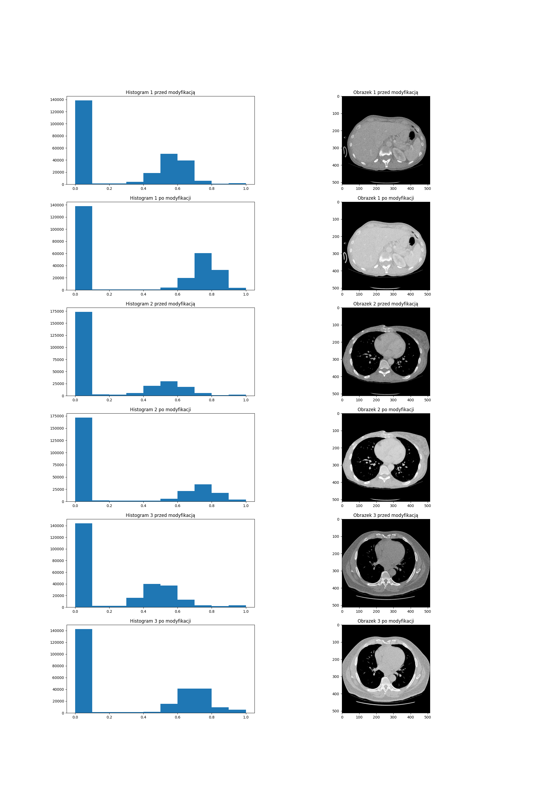

# Praca domowa nr 3 - preprocessing
## Część pierwsza
Fragment opisujący preprocessing zawarty w artykule.
>A lung segmentation dataset is introduced in the Lung Nodule Analysis (LUNA) competition at the Kaggle Data Science Bowl in 2017.  This dataset consists of 2D and 3D CT images with respective label images for lung segmen-tation [1].  We use 70% of the data as the train set and the remaining 30% as the test set.  The size of each image is 512×512. Since the lung region in CT images have almost the same Hausdorff value with non-object of interests such as bone and air, it is worth to learn lung region by learning its surrounding tissues.  To do that first we extract the surrounding region by applying algorithm 1 and then make anew mask for the training sets. We train the model on thesenew masks and on the testing phase,and estimate the lung region as a region inside the estimated surrounding tissues.
>

Dokładna analiza preprocessingu dokonanego przez twórców artykułu, znajduje się Jupyter Notebook'u w folderze code.
## Część druga

Pierwszą wykonaną operacją na histogramie jest 'contrast stretching'. Metoda ta polega na tym, aby 'rozciągnąć' histogram na całą możliwą skalę kolorów. Przykładowo, jeśli na obrazie występowałyby piksele o wartościach z przedziału [100;200], to zostałyby rozciągnięte poprzez odjęcie od każdego piskela minimalnej wartości i podzielenie przez długość oryginalnego przedziału, tak, aby wypełniały cały przedział [0; 255]. Do uczenia naszego modelu podajem wartości pikseli z zakresu [0;1], więc przeprowadziliśmy ponowne skalowanie.

Niestety większość obrazów w naszych danych od razu wypełniała całą przestrzeń szarości, więc zmiany są bardzo subtelne, nawet niezauważalne.

Wyniki (albo ich brak) prezentuje poniższy wykres:

W drugiej próbie postanowiłem wykorzystać technikę 'histogram equalization'. Polega ona na takiej zmianie wartości na obrazie, aby wszystkie wartości pikseli występowały mniej więcej równomiernie. Zamierzone działanie przedstawia poniższy rysunek

source: [https://staff.fnwi.uva.nl/r.vandenboomgaard/IPCV20162017/_images/histeq.png](https://staff.fnwi.uva.nl/r.vandenboomgaard/IPCV20162017/_images/histeq.png)

Metoda polega na zastosowaniu interpolacji na skumulowanych sumach wartości z histogramu. Ma ona jednak jedną wadę - jeśli interpolujemy zera, to w wyniku również dostaniemy zera. Znaczna część obrazów z naszego zbioru miała dużą ilość czarnych pikseli, więc wygładzenie zadziała tylko na pozostałej części histogramu Na danych z naszego zbioru prezentuje się to tak:

Na trzecią modyfikację wybraliśmy przekształcenie nieliniowe tanh(x + 0.8). Tak zastosowane przekstałcenie rozjaśnia piksele o wartości większej od zera.
Aby wartości przyjmowane przez piksele mieściły się w przedziale [0; 1], zostały one znormalizowane metodą min-max.  Następnie w celu wyświetlenia obrazów przemnożyliśmy wszystkie piksele przez 255, by były z zakresu [0; 255].

## Część czwarta

Wyszukaj informacji o sieciach, które biorą obrazki z wartościami pikseli większymi niż 0-255 (8-bitów). Napisz, co zostało zmodyfikowane, aby móc się posługiwać takimi obrazkami i dlaczego.

Na to pytanie postaram się odpowiedzieć głównie na podstawie medycznych obrazów zapisanych w formacie DICOM. Jest to bardzo popularny format, a jednocześnie adekwatny do problemu, gdyż wartości pikseli mogą, w zależności od standardu, przyjmować wartości 10 albo 12 bitowe, zatem większe niż standardowe przy innych formatach 255. 

Odpowiedź opiera się na dwóch repozytoriach [https://github.com/harsh1795/CNN-DICOM-Segmentation](https://github.com/harsh1795/CNN-DICOM-Segmentation), oraz [https://www.kaggle.com/allunia/pulmonary-dicom-preprocessing](https://www.kaggle.com/allunia/pulmonary-dicom-preprocessing).

W obu tych pracach preprocessing polega na konwersji danych surowych (wartości pikseli) na skalę Hounsfielda. To jednak nie zmniejsza liczby wartości, które piksele mogą przyjmować. W ten sposób łatwiej jest jednak rozróżniać między różnymi ośrodkami, a co za tym idzie różnymi tkankami w ciele człowieka.

W kolejnym etapie w zależności od użytej architektury sieci neuronowej, wartości HU mogą być skalowane, tak aby pokrywały przedział [-1;1]
Dzięki temu minimalizacja funkcji straty za pomocą gradient descent przebiega w łatwiejszy sposób, i jest to niejako standard w dziedzinie. 

W innych sieciach jako wejście mogą być podawane po prostu wartości w skali HU.

W dziedzinach poza medycyną skala kolorów większa niż 24bitowa jest rzadko spotykana, i nie udało mi się znaleźć artykułów opisujących sieci neuronowe działające na takich danych.
