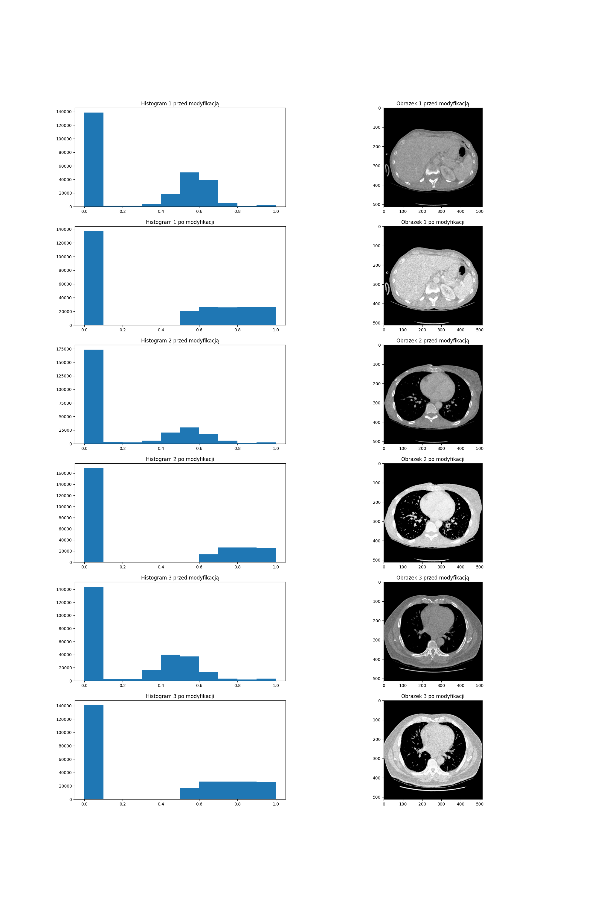

# Praca domowa nr 3 - preprocessing

## Część druga

### Mikołaj Spytek

Pierwszą wykonaną przeze mnie operacją na histogramie jest 'contrast stretching'. Metoda ta polega na tym, aby 'rozciągnąć' histogram na całą możliwą skalę kolorów. Przykładowo, jeśli na obrazie występowałyby piksele o wartościach z przedziału [100;200], to zostałyby rozciągnięte poprzez odjęcie od każdego piskela minimalnej wartości i podzielenie przez długość oryginalnego przedziału, tak, aby wypełniały cały przedział [0; 255]

Niestety większość obrazów w naszych danych od razu wypełniała całą przestrzeń szarości, więc zmiany są bardzo subtelne, nawet niezauważalne.

Wyniki (albo ich brak) prezentuje poniższy wykres:

W drugiej próbie postanowiłem wykorzystać technikę 'histogram equalization'. Polega ona na takiej zmianie wartości na obrazie, aby wszystkie wartości pikseli występowały mniej więcej równomiernie. Zamierzone działanie przedstawia poniższy rysunek

source: [https://staff.fnwi.uva.nl/r.vandenboomgaard/IPCV20162017/_images/histeq.png](https://staff.fnwi.uva.nl/r.vandenboomgaard/IPCV20162017/_images/histeq.png)

Na danych z naszego zbioru prezentuje się to tak:

